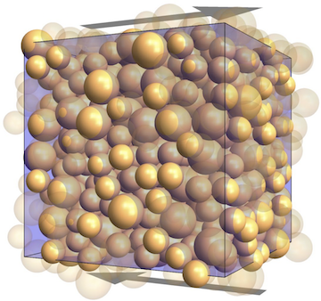

# LF_DEM

|                                      |                             |
|--------------------------------------|-----------------------------|
|**A code simulating simple shear flow of dense, overdamped suspensions of spherical particles. It includes hydrodynamics, contacts (with several contact models), potential interactions, and Brownian motion.** |  |


##Requirements

LF_DEM requires the sparse linear algebra software
[SuiteSparse](http://faculty.cse.tamu.edu/davis/suitesparse.html) to
be installed.

To install SuiteSparse on CUNY-HPPC, see [these instructions](./SuiteSparse_Install.md).

##Getting the code

### By using git

We strongly encourage to use the version control system Git (for [Mac OS X](http://git-scm.com/download/mac), for [Linux](http://git-scm.com/download/linux)). This will allow you to get updates
of the code in a very easy and clean way and to contribute to the code
by sending bug fixes or new features with a minimal effort.

You can get the code by typing in a terminal:
```
$ git clone https://rmari@bitbucket.org/rmari/lf_dem.git
```
This will download the current sources (and also the past sources).

If at any point in the future you want the latest sources of the code:
```
$ git pull
```
and that's it!

### By direct download

Download from here (bitbucket.org) by clicking the download icon (cloud), select "Download repository" and unzip.


##Installation

In the `LF_DEM` folder, edit the Makefile and change the variables
```OS_version``` to "OSX" or "Linux" depending on your
environment. This variable controls the include paths and flags to be
used to compile. This has been tested on very few machines, and is
probably not generic. If you want to install `LF_DEM` to a specific
location listed in your `$PATH`, you can set the variable
`install_dir` in the Makefile.

Once those changes to Makefile saved, you can simply compile in a terminal via:

```
$ make
$ make install
```

The second command is only needed if you want to install `LF_DEM` in the given `install_dir`.

##Usage

See our [wiki](https://bitbucket.org/rmari/lf_dem/wiki/Home)!
